# ЗИС ПР №1. Phishing

Выполнил Сердюков Матвей, ББМО-01-23

## Запуск docker-compose:
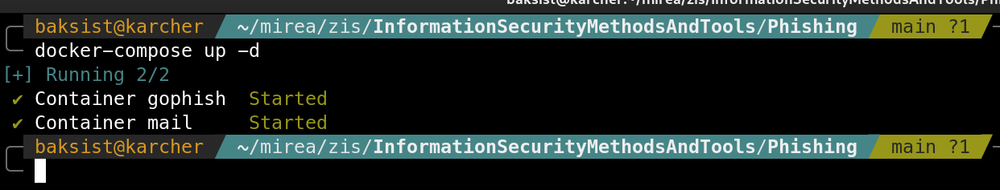

## Генерация сертификатов

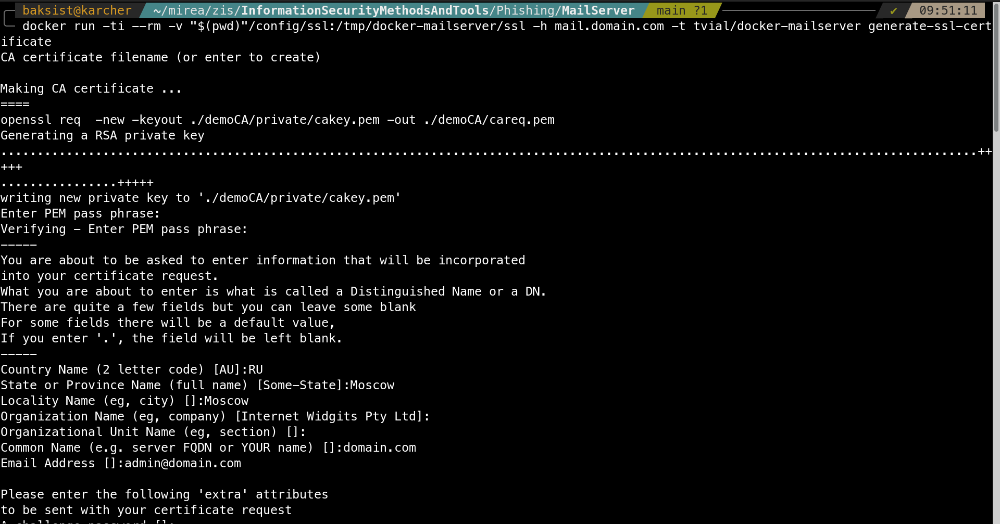
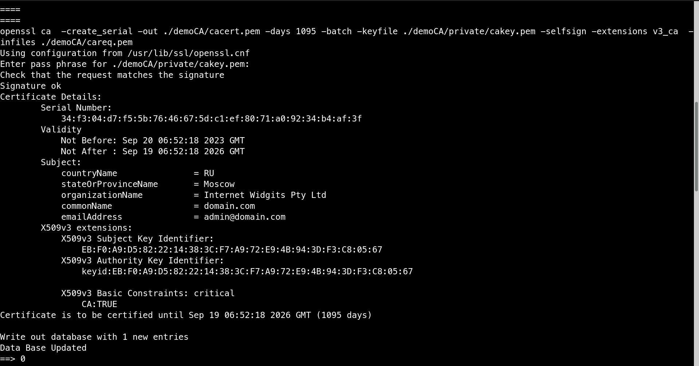
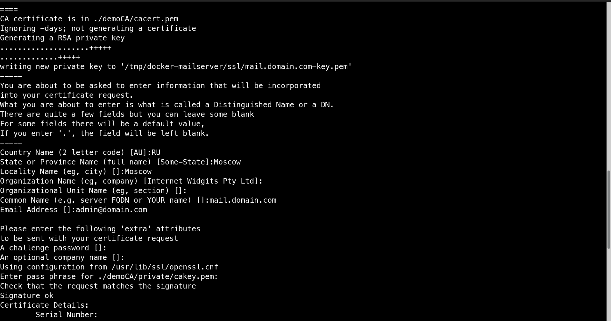
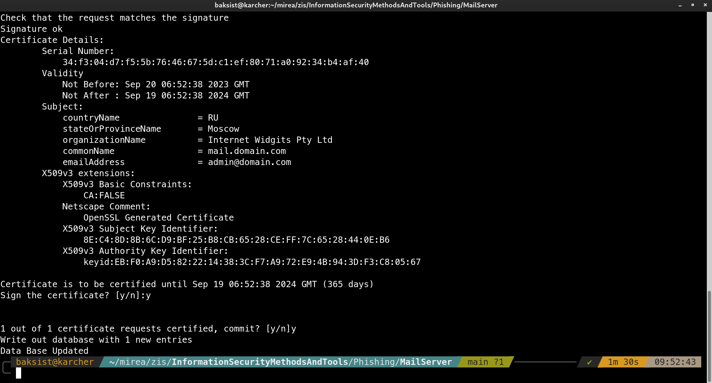
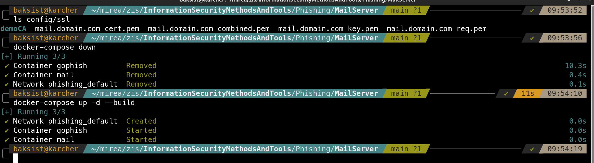

## Создание пользователей и проверка отправки писем

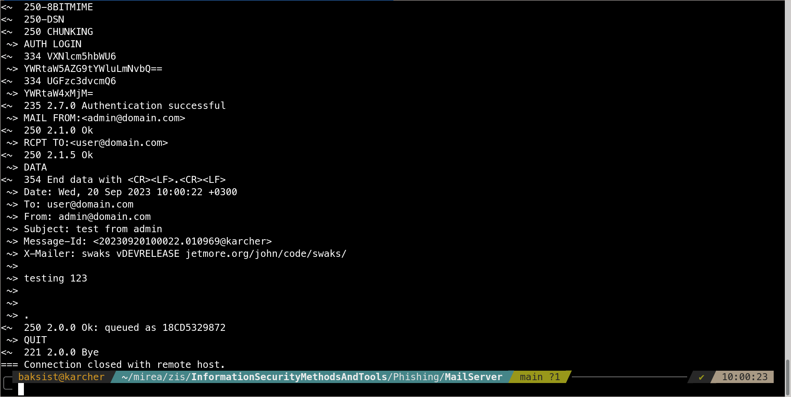

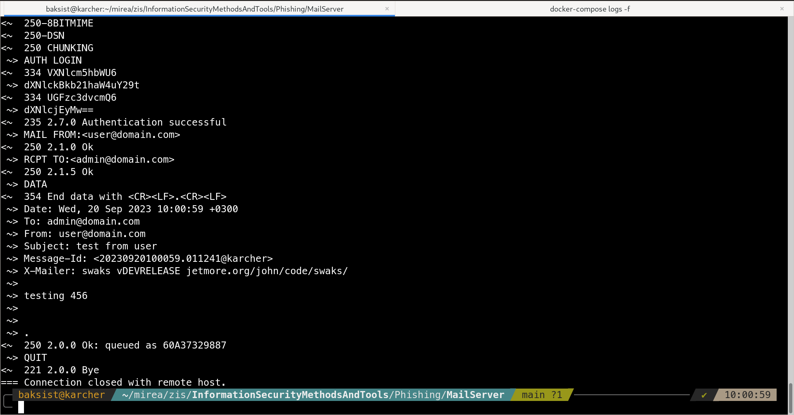

## Добавление аккаунта в Thunderbird

## Создание профиля в Gophish

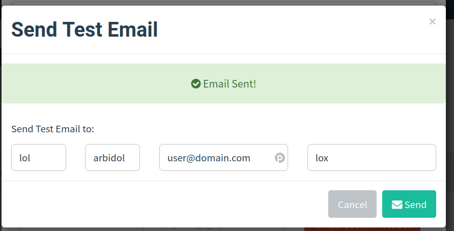

## Создание лендинга
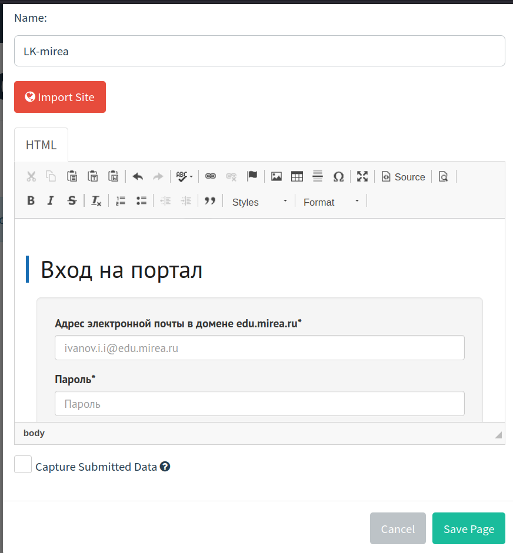

## Создание шаблона письма

## Создание группы для рассылки
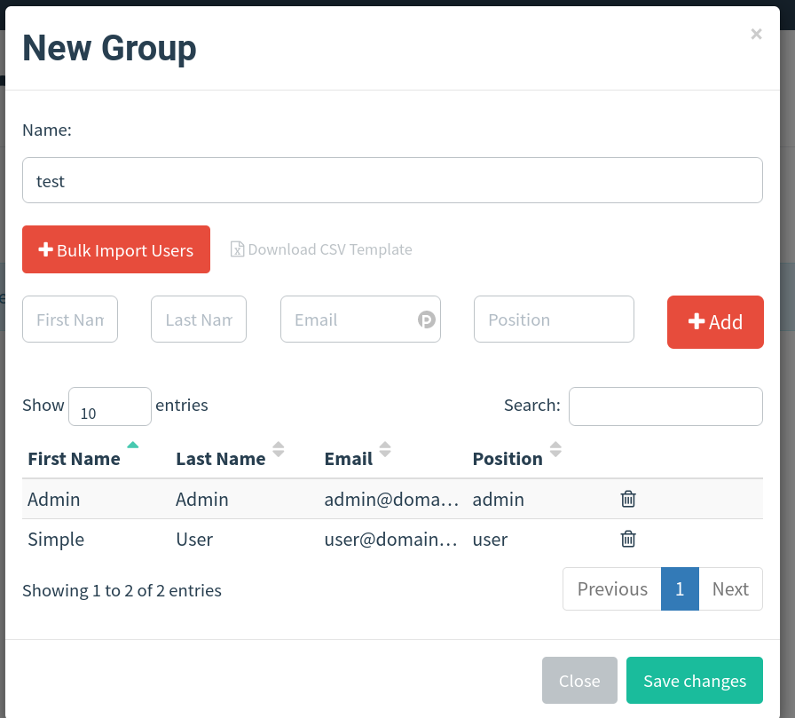

## Создание фишинговой кампании

## Полученное письмо
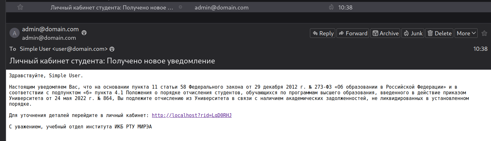

## Фишинговый сайт
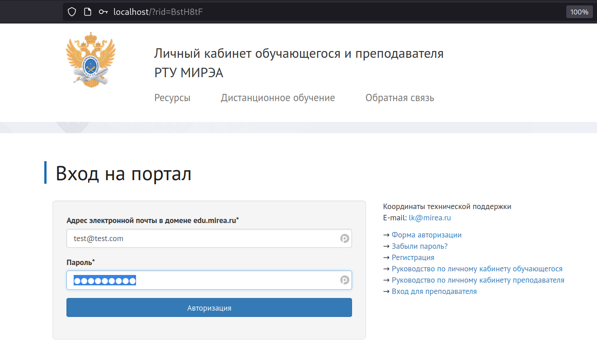

## Результаты кампании

## Полученные учётные данные
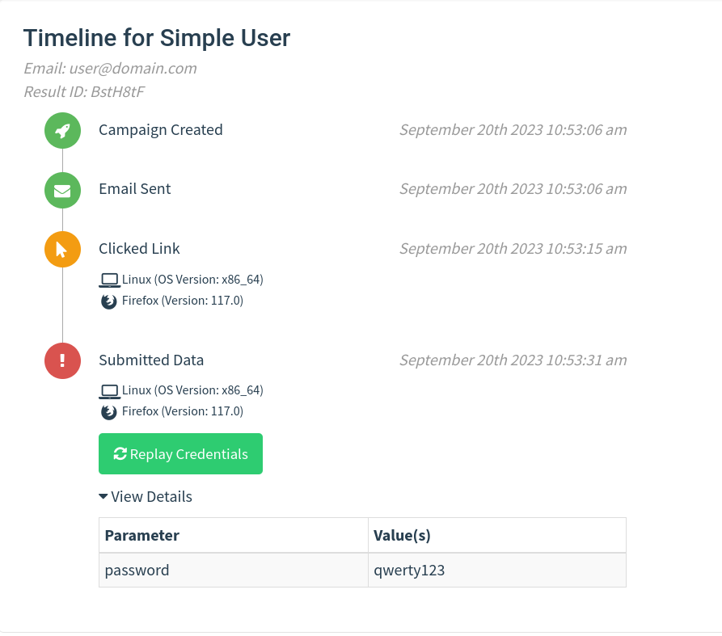

