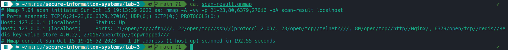
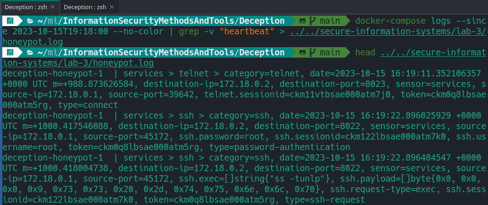

# ЗИС ПР №3. Deception

Выполнил Сердюков Матвей, ББМО-01-23

## Запуск honeypot


## Определение портов, открытых при запуске служб


## Сканирование портов для определения запущенных служб



## Запуск симуляции активности злоумышленника


## Фильтрация и сохранение логов контейнера для дальнейшего анализа



## Анализ действий злоумышленника

### FTP - порт 21

#### Выполненные команды

```
USER anonymous
PASS anonymous
FEAT
STOR /etc/passwd
LIST -l
HELP
APPE /exploit.sh
PWD
```

Команды `USER anonymous` и `PASS anonymous` используются для аутентификации на FTP-сервере. Успешная аутентификация с такими учётными данными означает, что на сервер включён анонимный вход, не требующий личной учётной записи. Подобная функция не должна быть использована на сервере, хранящем конфиденциальную информацию. 

Команда `FEAT` нужна для отображения списка поддерживаемых дополнительных функций. Таким образом злоумышленник узнаёт дополнительную информацию о сервере и устанавливает, какие команды может выполнять.

Команда `STOR` загружает файл `/etc/passwd` на сервер. Видимо, таким образом злоумышленник подменяет имеющиеся там учётные данные на свои собственные, чтобы в дальнейшем получить доступ по известным ему логину и паролю.

Команда `LIST -l` используется для отображения содержимого текущей директории. С её помощью можно узнать, какие файлы хранятся на сервере.

С помощью команды `APPE /exploit.sh` также можно загрузить файл на сервер, но она дополняет файл новым содержимым, если он уже существует. Вероятно в данном случае загружается эксплойт на скриптовом языке Bash, который потенциально может быть использован для дальнейшего повышения привилегий на сервере.

Команда `PWD` выводит текущую директорию и несёт информативный характер.

### SSH - порт 22

#### Выполненные команды

```
аутентификация с учётными данными root:root
ss -tunlp
cat /etc/shadow
pwd
ls
ip a
```

Команда `ss -tunlp` выводит информацию об открытых портах на сервере. Флаги `-tu` указывают на демонстрацию TCP и UDP портов, флаг `-n` нужен для отключения преобразования IP-адреса в доменное имя, флаг `-l` обозначает, что нужно вывести только те порты, который принимают подключения (находятся в состоянии LISTEN), а флаг `-p` указывает, что нужно вывести имя процесса, которым было открыто подключение. С помощью этой команды можно узнать, какие сетевые службы работают на сервере.

Команда `cat /etc/shadow` выводит содержимое соответствующего файла. В файле `/etc/shadow` хранятся хешированные пароли пользователей в Linux-системе. Эти хэши могут быть подобраны атакой методом перебора, благодаря чему злоумышленник способен получить пароли пользователей. Учитывая, что он предварительно зашёл на сервер с учётными данными `root:root` и получил сессию суперпользователя, не совсем ясно, зачем ему это.

Команды `pwd` и `ls` выводят соответственно текущую директорию и её содержимое и несут информативный характер.

Команда `ip a` выводит всю информацию о сетевых интерфейсах, имеющихся на сервере. 

### telnet - порт 23

#### Выполненные команды

```
аутентификация с учётными данными root:root
display snmp-server arp-sync table
system-view
display arp interface GigabitEthernet 0/0/1
display arp
display session limit vpn-instance vpna
```

Судя по выполняемым командам, а также результатам сканирования службы через `nmap`, в данном случае злоумышленником была получена сессия в консоли сетевого оборудования Huawei.

Команда `display snmp-server arp-sync table` выводит информацию об ARP-записях на устройстве, в которых сопоставляются IP- и MAC-адреса устройств в сети. В данном случае выводятся только те записи, которые синхронизируются по протоколу SNMP между различными сетевыми устройствами.

С помощью команды `system-view` пользователь переходит в привилегированный системный режим, который позволяет настраивать различные параметры и настройки устройства. 

Команда `display arp interface GigabitEthernet 0/0/1` используется для отображения записей таблицы ARP, специфичных для интерфейса с именем "GigabitEthernet 0/0/1".

Команда `display arp` используется для отображения всей таблицы ARP на сетевом устройстве.

С помощью команды `display session limit vpn-instance vpna` происходит отображение информации о лимитах сессий для конкретного экземпляра VPN с именем "vpna". 

Таким образом злоумышленник получил подробную информацию об устройствах, находящихся в локальной сети, и может использовать её проведения дальнейших атак, как например `arp spoofing`.

### HTTP - порт 80

#### Выполненные запросы

```
GET /robots.txt
GET /admin
GET /phpinfo.php
GET /admin.php
GET /login.php
```

Сначала злоумышленник обратился к странице `/robots.txt`. Обычно в этом файле указываются разделы сайта, которые не должны индексироваться поисковыми ботами, но зачастую системные администраторы вставляют в него пути к административным страницам и файлам, которые могут быть легко прочитаны злоумышленником, если разграничение доступа на веб-сервере реализовано некорректно.

Видимо, именно это и произошло - после этого последовали запросы к страницам `/admin`, `/phpinfo.php`, `/admin.php` и `/login.php`. Первые два и последний запросы вполне очевидны, а в файле `phpinfo.php` злоумышленник способен получить информацию о текущем экземпляре PHP, запущенном на сервере. С её помощью можно определить, подвержен ли веб-сервер известным уязвимостям, если версия окажется достаточно старой.

### redis - порт 6379

#### Выполненные команды

```
GET admin
KEYS * 
SELECT 1
CONFIG GET *
INFO
```

Команда `GET admin` команда используется для извлечения значения, связанного с указанным ключом. Если ключ "admin" существует, она вернет соответствующее значение, возможно это будет пароль учётной записи администратора.

Команда `KEYS *` используется для получения списка всех ключей, хранящихся в Redis. 

При выполнении команды `SELECT 1` выбирается база данных с номером 1. 

С помощью команды `CONFIG GET *` выводятся все параметры конфигурации Redis. Она возвращает текущие настройки Redis, включая параметры сервера, сохранения данных, и многие другие.

Команда `INFO` возвращает информацию о текущем состоянии сервера Redis, включая информацию о версии Redis, статистику использования памяти, статистику по ключам и другие сведения о сервере. 

Выполняя эти команды, злоумышленник получает доступ к большому количеству информации, содержащейся в БД Redis.